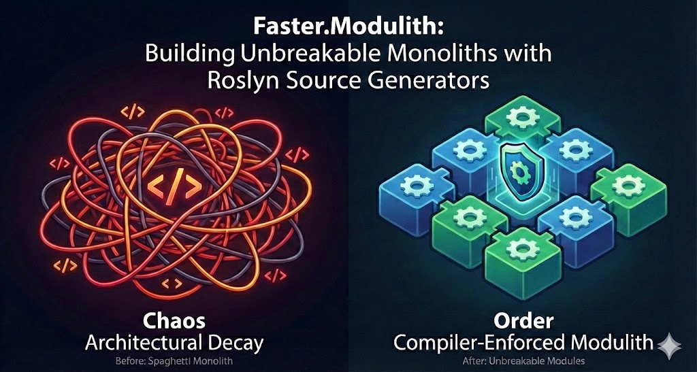
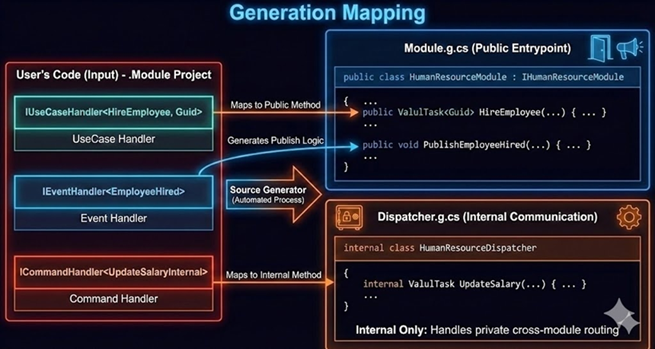
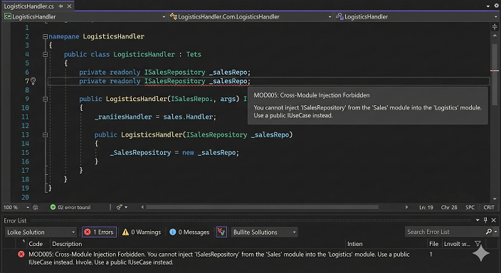
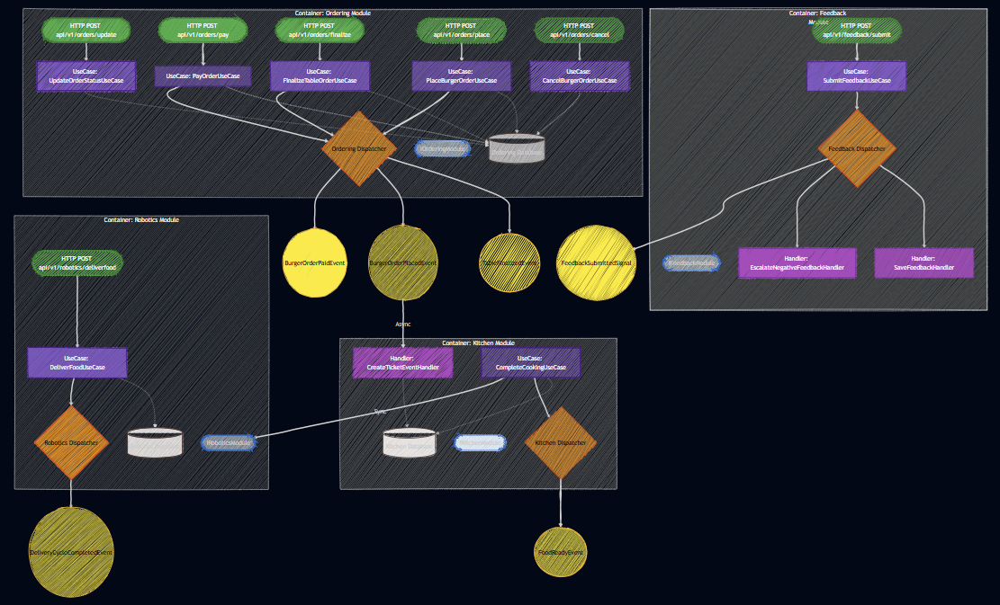

# Faster.Modulith
### *Building Unbreakable Monoliths with Roslyn*

   

**Ensuring that the last feature you build is just as easy to ship as the first.**

---
## 📖 Table of Contents
- [The Tragedy of Good Intentions](#the-tragedy-of-good-intentions)
- [The "Vault" Architecture](#the-vault-architecture)
- [The 3 Laws of Vault](#the-3-laws-of-vault)
- [How It Works](#how-it-works)
- [Getting Started (In 60 Seconds)](#getting-started-in-60-seconds)
    - [1. The "Lazy" Way: CreateModule.cmd](#1-the-lazy-way-createmodulecmd)
    - [2. The Manual Way: Required Packages](#2-the-manual-way-required-packages)
- [Implementation Steps](#implementation-steps)
    - [Step 1: Define your Key (in .Api)](#step-1-define-your-key-in-api)
    - [Step 2: Implement the Logic (in .Module)](#step-2-implement-the-logic-in-module)
    - [Step 3: Wire it up (in Program.cs)](#step-3-wire-it-up-in-programcs)
- [Auto-Generated Endpoints (The Expose Attribute)](#auto-generated-endpoints-the-expose-attribute)
- [Roslyn Analyzers](#the-enforcer-analyzers)
- [SourceGenerators](#the-magician-generators--dx)
- [Auto-Generating Architecture Diagrams (Mermaid.js)](#auto-generating-architecture-diagrams-mermaidjs)
- [Project Structure](#project-structure)
- [The Escape Hatch: `[ArchitectureBypass]`](#the-escape-hatch-architecturebypass)
- [Pipeline Behavior](#pipeline-behavior)
---

## The Tragedy of Good Intentions

At some point, every team realizes they aren't fighting bugs or performance issues anymore. **They are fighting the architecture.**

What makes this especially painful is that the architecture usually looked *perfect* at the beginning. It followed best practices. It used the right patterns. The diagram had colorful boxes with neat arrows. It passed code reviews. Nothing was obviously wrong—until months of lost time made the cost impossible to ignore.

In .NET projects, architectural mistakes rarely show up as broken code or compile errors. They show up as **hesitation**. They show up as 4 PM Friday meetings about "circular dependencies." They show up as fear of change. They turn capable teams into cautious ones and productive systems into fragile artifacts.

**Faster.Modulith** exists because we got tired of fighting.

It’s not about choosing Clean Architecture over Vertical Slices. It’s about taking those architectural decisions that feel safe early on, and **locking them in a vault guarded by the compiler**
eliminating the possibility of **architectural drift**. 
---

## Getting Started (In 60 Seconds)

We do not believe in manual setup. We believe in scripts. Before you write a single line of code, understand the goal: moving from a tangled "Spaghetti Monolith" to a system of **Unbreakable Modules** where boundaries are enforced by the compiler.

### 2. Apply the Default Modulith Template
Before adding individual modules, establish your baseline configuration by copying the templates provided by this repository. This centralizes the setup for common modules like Kitchen, Ordering, Robotics, and Feedback.

### 2. The "Lazy" Way: CreateModule.cmd
Do not create projects manually. Use our CLI helper to scaffold the **Vault** structure perfectly every time. This ensures your projects are born with the correct "DNA" and analyzer references.

```powershell
# Scaffolds Module.HumanResources, Module.HumanResources.Api, and Module.HumanResources.Tests
.\CreateModule.cmd HumanResources
```
## 2. The Manual Way: Required Packages

If you choose not to use the batch file, you must manually add the following references to both your **.Api** and **.Module** projects to enable the generator, contracts, and architectural guardrails:

### In your .Api AND .Module Projects:

```xml
<ItemGroup>
    <PackageReference Include="Faster.Modulith.Analyzers" Version="1.1.3" OutputItemType="Analyzer" ReferenceOutputAssembly="false" />
</ItemGroup>
```

## Step 1: Define your Key (in .Api)

Open your new **.Api** project and create a record. This record serves as your **Key**, defining the entry point to your module. Ensure you use the required contracts namespace for all `IUsecase` types.

### Project: Module.HumanResources.Api

```csharp
using Faster.Modulith.Contracts;

namespace Module.HumanResources.Api;

public record HireEmployeeUseCase(string Name, decimal Salary) : IUsecase<Result<Guid>>;
```

## Step 2: Implement the Logic (in .Module)

Open the **.Module** project and create a class. This class acts as your **Vault**. To maintain strict architectural boundaries, the class must be marked as **internal**. Do not manually type the interface; utilize the **CodeFix** to scaffold the implementation.

---

### Project: Module.HumanResources

```csharp
using Module.HumanResources.Api;
using Faster.Modulith.Contracts;

namespace Module.HumanResources;

internal sealed class HireEmployeeHandler : IUseCaseHandler<HireEmployeeUseCase, Result<Guid>>
{
    /// <summary>
    /// Handles the HireEmployeeUseCase request.
    /// </summary>
    /// <param name="usecase">The usecase data.</param>
    /// <param name="cancellationToken">The cancellation token.</param>
    /// <returns>A Result containing the Guid of the hired employee.</returns>
    public async Task<Result<Guid>> Handle(HireEmployeeUseCase usecase, CancellationToken cancellationToken)
    {      
        return await Task.FromResult(Result<Guid>.Success(Guid.NewGuid()));
    }
}
```

## Step 3: Wire it up (in Program.cs)

Registration is simplified to one line per module. These extension methods are generated automatically to ensure all internal services and dispatchers are correctly registered—even if no usecases currently exist.

**Crucial:** To ensure consistency, every piece of generated code—from dispatchers to extension methods—resides strictly in the `Faster.Modulith` namespace.

---

### Project: Main Host

```csharp
// 2026-01-31 13:11:30 - Registering module services
using Faster.Modulith;

// The generated extension method resides in the Faster.Modulith namespace
builder.Services.AddHumanResourcesModule();

```

The Source Generator acts as the architect, automatically splitting your logic into the correct structural files. This ensures the public Facade remains the only entry point, while the Dispatcher handles internal traffic.

What goes where?
Module.g.cs (Public Entrypoint): Contains the HumanResourceModule : IHumanResourceModule. This is the "Front Door." It handles IUsecaseHandler mappings and IEventHandler publishing logic.

Dispatcher.g.cs (Internal Communication): An internal class that handles private cross-module routing. This is where ICommandHandler implementations are registered. It is inaccessible from outside the module and is generated even if the module is empty to ensure stable DI.

Extensions.g.cs: Contains the IServiceCollection logic to register all handlers and generated types automatically. All code in this file is generated into the Faster.Modulith namespace.



---

## The (Analyzers)

We include a suite of Roslyn Analyzers that act as your strict architectural bodyguard. They catch "invisible mistakes" during development before the code is even committed.

| Code | Severity | Rule Name | Description |
| :--- | :--- | :--- | :--- |
| **MOD005** | 🔴 Error | **The "Vault" Rule** | **Cross-Vault Injection.** You cannot inject `IFacilitiesService` into `HumanResources`. You must use the Orchestrator. |
| **MOD001** | 🔴 Error | **Leaking Internals** | Your Domain Events and Commands must be **internal**. If it is public, it belongs in the `.Api`. |
| **MOD018** | 🟡 Warning | **Public Entities** | **Stop making your EF Core entities public.** They are for your internal logic, not your neighbors. |
| **MOD033** | 🔴 Error | **Sneaky Controllers** | You cannot hide an ASP.NET Controller inside a Module DLL. Keep the protocol out of the domain. |
| **MOD034** | 🔴 Error | **DTO Leakage** | Your public API cannot return an internal Domain Entity. Map it or wrap it. |

## Enforcing Strict Isolation

The image captures the **MOD005** analyzer in action, blocking an attempt to use a type that belongs to a different module's internal scope. By triggering a hard compiler error, the framework physically prevents cross-module coupling before the code can even be built. This ensures the "Vault" remains impenetrable, forcing developers to use the official API rather than taking the path of least resistance.



## Sourcegenerators

In most Modular Monoliths, calling another module is a nightmare of "Search Hell." You have to search through 50 folders to find the exact class name of the message. Is it `CreateUserCommand`? `AddUser`? `UserRegistrationRequest`?

**Faster.Modulith** solves this by generating **Friendly APIs** that provide instant discovery via IntelliSense.

### 1. The Generated EntryPoint (The Public Facade) 
Instead of interacting with the raw engine, the Source Generator creates a **Public API Wrapper** (`I{ModuleName}Api`) for every module. This acts as the facade for cross-module communication.

**Why this enriches your DX:**
* **No "Search Hell":** You do not need to hunt for specific message classes.
* **IntelliSense Discovery:** Simply type `_moduleName` and your IDE lists exactly what Human Resources can do.
* **Strong Typing:** The method signatures are generated directly from your contracts.

### 2. The Generated Dispatcher (The Internal Manager) 
Inside the module, you often have dozens of internal Commands (`CalculateTax`, `ValidateVisa`, `SendWelcomeEmail`) that should never be exposed publicly. The Source Generator creates an **Internal Dispatcher** (`I{Module}Dispatcher`) specifically for your module's internal coordination.

### 3. Auto-InternalsVisibleTo
Testing "Internal" code is usually a nightmare of `AssemblyInfo.cs` edits. Our Source Generator automatically detects your `Module.X.Tests` project and injects the `[InternalsVisibleTo]` attribute into your main module.

---

## Project Structure
The framework enforces a specific physical structure to ensure the "Vault" stays locked.

| Path | Purpose | Visibility |
| :--- | :--- | :--- |
| `/src/Modules/Module.HumanResources` | **Internal Vault / Domain** | 🔴 Internal |
| `/src/Modules/Module.HumanResources.Api` | **Public Keys / Contracts** | 🟢 Public |
| `/src/Modules/Module.HumanResources.Tests` | **Integration Tests** | 🟡 Internal |

* If you try to put a **UseCase** in the `Module` project? **Error MOD030**.
* If you try to put a **Handler** in the `Api` project? **Error MOD031**.

## The Escape Hatch: `[ArchitectureBypass]`

We know that real life is messy. Sometimes you have a legacy migration or a circular dependency that you cannot fix today. Instead of suppressing warnings (which hides the problem), we force you to be honest.

```csharp
// This will suppress the Analyzer Error, but it documents your shame.
[ArchitectureBypass("MOD005", "We need to fix the circular dependency in Q3 2026")]
private readonly IFacilitiesDispatcher _legacyInjection;
```

## Pipeline Behavior

The Modulith source generator supports pipeline behaviors (middleware) for handling cross-cutting concerns like validation, logging, and transactions. These behaviors wrap your command execution pipeline, allowing you to intercept requests before and after they reach the handler.

### 1. Attribute-Based Registration (`[EnrichWith]`)

Use the `[EnrichWith]` attribute to apply specific behaviors to individual **Commands** or **Handlers**. This is useful for specific policies (e.g., validation) that apply only to certain use cases.

```csharp
using Faster.Modulith.Contracts;

// Apply directly to the Command (Recommended)
[EnrichWith(typeof(ValidationBehavior<,>))]
[EnrichWith(typeof(LoggingBehavior<,>))]
public record CreateEmployeeCommand(string Name) : ICommand<int>;
```

The generator will automatically:
1. Detect these attributes.
2. Register the specific generic service for that command type in the DI container.
3. Generate the dispatcher code to execute these behaviors.

### 2. Global / Manual Registration

For behaviors that apply to **all** commands (global policies) or if you prefer to avoid attributes, you can register them manually in the `AddInfrastructure` partial method.

The source generator inspects your `AddInfrastructure` method body. If it detects the string `IPipelineBehavior`, it automatically generates the necessary pipeline wrapping logic in the dispatcher to support your manual registrations.

```csharp
// HumanResourcesExtensions.Infrastructure.cs
namespace Faster.Modulith;

public static partial class HumanResourcesExtensions
{
    static partial void AddInfrastructure(IServiceCollection services)
    {
        // Global Registration: Applies to all commands in this module
        // Note: Using open generics matches all requests
        services.AddScoped(typeof(IPipelineBehavior<,>), typeof(GlobalLoggingBehavior<,>));
        
        // Manual/Conditional Registration
        if (Environment.GetEnvironmentVariable("ENABLE_METRICS") == "true")
        {
            services.AddScoped(typeof(IPipelineBehavior<,>), typeof(MetricsBehavior<,>));
        }
    }
}
```

### Execution Order

The dispatcher resolves all registered behaviors for a request and executes them in **reverse registration order** (Outer → Inner), creating a "Russian Doll" structure.

1.  **Outer:** Global Behaviors (Manual Registration in `AddInfrastructure`)
2.  **Inner:** Attribute Behaviors (`[EnrichWith]`)
3.  **Core:** Command Handler

### Implementing a Behavior

Behaviors must implement the `IPipelineBehavior<TRequest, TResponse>` interface.

```csharp
using Faster.Modulith.Contracts;
using Microsoft.Extensions.Logging;

public class LoggingBehavior<TRequest, TResponse> : IPipelineBehavior<TRequest, TResponse>
    where TRequest : notnull
{
    private readonly ILogger<LoggingBehavior<TRequest, TResponse>> _logger;

    public LoggingBehavior(ILogger<LoggingBehavior<TRequest, TResponse>> logger)
    {
        _logger = logger;
    }

    public async ValueTask<TResponse> Handle(TRequest request, RequestHandlerDelegate<TResponse> next, CancellationToken ct)
    {
        _logger.LogInformation("Starting Request: {Name}", typeof(TRequest).Name);
        
        // Call the next step in the pipeline (or the handler)
        var response = await next();
        
        _logger.LogInformation("Completed Request: {Name}", typeof(TRequest).Name);
        
        return response;
    }
}
```
# Auto-Generated Endpoints (The `Expose` Attribute)

Writing boilerplate controllers or manually mapping Minimal APIs for every use case introduces friction and increases the risk of architectural drift.

To eliminate this overhead, **Faster.Modulith** provides the `Expose` attribute.

Instead of writing a dedicated web layer, you apply this attribute directly to your **Handler** inside the internal `.Module` project. The Source Generator reads this attribute and automatically scaffolds the ASP.NET Core Minimal API endpoints in the `.Api` project for you.

This guarantees that your HTTP layer perfectly mirrors your internal capabilities — **without exposing the handlers themselves**.

---

## How It Works

Decorate your internal handler with the `Expose` attribute and define the desired HTTP route.

The generator will:

1. Inspect the handler  
2. Discover its associated `UseCase`  
3. Generate the appropriate public endpoint  

---

## Example: Internal Handler

```csharp
using Faster.Modulith.Contracts;
using Microsoft.EntityFrameworkCore;
using Module.Ordering.Api.UseCases;
using Module.Ordering.Infrastructure;
using System;
using System.Threading;
using System.Threading.Tasks;

namespace Module.Ordering.Application.UseCases;

/// <summary>
/// Handles requests to update the status of an order.
/// </summary>
/// <remarks>
/// If the specified order does not exist, the handler returns a failure result.
/// An InvalidOperationException may be thrown if the status update operation fails.
/// </remarks>
/// <param name="db">The database context used to access and modify order data.</param>
[Expose("api/v1/orders/update")]
internal sealed class UpdateStatusHandler(OrderingDbContext db)
    : IUseCaseHandler<UpdateOrderStatusUseCase, Result>
{
    /// <summary>
    /// Handles the update of an order's status based on the provided request.
/// </summary>
    public async ValueTask<Result> Handle(UpdateOrderStatusUseCase request, CancellationToken ct)
    {
        var order = await db.Orders.FirstOrDefaultAsync(x => x.Id == request.OrderId, ct);
        if (order is null)
            return Result.Failure("Order not found.");

        try
        {
            order.UpdateStatus(request.NewStatus);
            await db.SaveChangesAsync(ct);
            return Result.Success;
        }
        catch (InvalidOperationException ex)
        {
            return Result.Failure(ex.Message);
        }
    }
}
```

---

## The Generated Output

The Source Generator automatically emits a static endpoint class into the `Faster.Modulith` namespace. It maps the routes defined on internal handlers directly to the public module interface.

When a request hits the endpoint, the generated code:

- Dispatches the use case  
- Unwraps the `Result` pattern  
- Returns the appropriate HTTP status code  

```csharp
// <auto-generated/>
using Microsoft.AspNetCore.Builder;
using Microsoft.AspNetCore.Http;
using Microsoft.AspNetCore.Routing;
using System.Threading;
using Faster.Modulith.Contracts;
using Module.Ordering.Api;

namespace Faster.Modulith;

/// <summary>
/// Endpoint mapping definitions for the Ordering module.
/// </summary>
/// <remarks>
/// This class is auto-generated and wires exposed use cases
/// into ASP.NET Core minimal API endpoints.
/// </remarks>
[global::System.Diagnostics.DebuggerStepThrough]
public static partial class OrderingEndpoints
{
    /// <summary>
    /// Maps all exposed endpoints for the Ordering module.
/// </summary>
    public static IEndpointRouteBuilder MapOrderingEndpoints(this IEndpointRouteBuilder app)
    {
        app.MapPost("/api/v1/orders/update",
            async (global::Module.Ordering.Api.UseCases.UpdateOrderStatusUseCase request,
                   IOrderingApi module,
                   CancellationToken ct) =>
        {
            var result = await module.UpdateOrderStatus(request, ct);
            return result.IsSuccess
                ? Results.Ok(result)
                : Results.NotFound(result.Error);
        })
        .WithTags("Ordering");

        app.MapPost("/api/v1/orders/finalize",
            async (global::Module.Ordering.Api.UseCases.FinalizeTableOrderUseCase request,
                   IOrderingApi module,
                   CancellationToken ct) =>
        {
            var result = await module.FinalizeTableOrder(request, ct);
            return result.IsSuccess
                ? Results.Ok(result)
                : Results.NotFound(result.Error);
        })
        .WithTags("Ordering");

        return app;
    }
}
```

---

## Wiring It Up

To activate the generated endpoints, call the generated mapping method in your `Program.cs` file immediately after registering the module’s core services.

```csharp
using Faster.Modulith;
using Microsoft.AspNetCore.Builder;
using Microsoft.Extensions.DependencyInjection;

var builder = WebApplication.CreateBuilder(args);

builder.Services.AddModulith(builder.Configuration, options =>
{
    options.AddKitchen(kitchenOptions =>
    {
        kitchenOptions.UseInMemory = true;
    });

    options.AddOrdering(orderingOptions =>
    {
        orderingOptions.UseInMemory = true; 
    });

    options.AddRobotics();
    options.AddFeedback();
});

var app = builder.Build();

// Automatically maps all endpoints decorated with [Expose]
app.MapOrderingEndpoints();

app.Run();
```

---

## Result

With a single attribute on your internal handler:

- ✅ No controllers  
- ✅ No manual endpoint mapping  
- ✅ No duplicated route definitions  
- ✅ No architectural leakage  

Your **Application layer remains pure**, and your **HTTP layer stays perfectly synchronized** with your internal use cases — automatically.

## Auto-Generating Architecture Diagrams (Mermaid.js)

Architecture diagrams are notorious for becoming obsolete the moment the next sprint begins. Manual diagrams rely on developer discipline, which often breaks down under tight deadlines. 

With **Faster.Modulith**, your code is your architecture. Because the Roslyn Source Generator builds a complete semantic model of your modules, exposed contracts, event subscriptions, and internal handlers, it automatically generates a live, mathematically accurate **C4 Model** using Mermaid.js.

### The "Always Accurate" Diagram

You do not need to maintain separate Visio or draw.io files. The source generator continuously maps your system's landscape and emits a static class containing the Mermaid markup. This markup reflects the exact state of your compiled code, mapping the interactions between your Host Application, Orchestrator, and individual Module Vaults.



### Exposing the Architecture

You can easily serve this generated diagram via a Minimal API endpoint, making it instantly available for your developer portal, continuous integration pipeline, or internal wiki.

**Ensuring the final feature is implemented as seamlessly as the first.**
