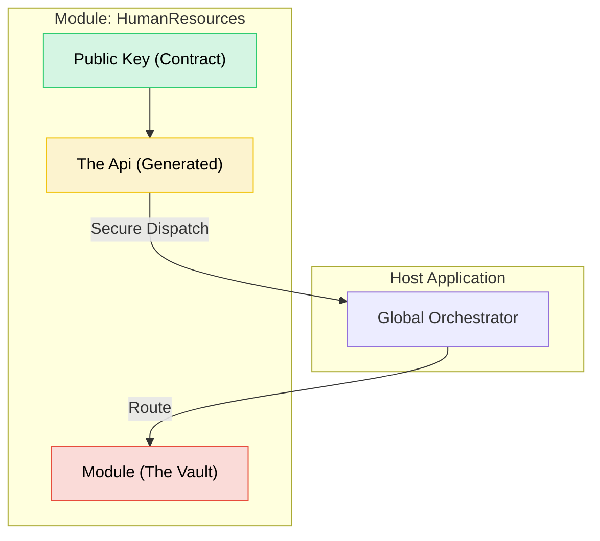
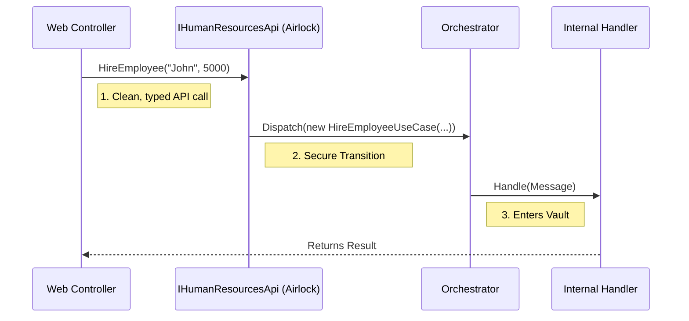

# Faster.Modulith
### *Building Unbreakable Monoliths with Roslyn*

   

**Ensuring the final feature is implemented as seamlessly as the first.**

---

## 📖 Table of Contents
- [The Tragedy of Good Intentions](#the-tragedy-of-good-intentions)
- [The "Vault" Architecture](#the-vault-architecture)
- [How It Works](#how-it-works)
- [Getting Started](#getting-started-in-60-seconds)
- [The Enforcer (Analyzers)](#the-enforcer-analyzers)
- [The Magician (Generators)](#the-magician-generators--dx)
- [Project Structure](#project-structure-the-law)

---

## The Tragedy of Good Intentions

At some point, every team realizes they aren't fighting bugs or performance issues anymore. **They are fighting the architecture.**

What makes this especially painful is that the architecture usually looked *perfect* at the beginning. It followed best practices. It used the right patterns. The diagram had colorful boxes with neat arrows. It passed code reviews. Nothing was obviously wrong—until months of lost time made the cost impossible to ignore.

In .NET projects, architectural mistakes rarely show up as broken code or compile errors. They show up as **hesitation**. They show up as 4 PM Friday meetings about "circular dependencies." They show up as fear of change. They turn capable teams into cautious ones and productive systems into fragile artifacts.

**Faster.Modulith** exists because we got tired of fighting.

It’s not about choosing Clean Architecture over Vertical Slices. It’s about taking those architectural decisions that feel safe early on, and **locking them in a vault guarded by the compiler**
eliminating the possibility of **architectural drift**. 

We stop the "Big Ball of Mud" by making the path of least resistance—tight coupling—physically impossible, **ensuring that the last feature you build is just as easy to ship as the first.**

---

## The "Vault" Architecture

Faster.Modulith is not just a library; it implements a **strict version of the Modular Monolith** that we call **"Vault."**

Most modular monoliths are "soft." They rely on namespaces and discipline to keep modules separate. But discipline fails when deadlines loom. **Vault Architecture** is hard. It treats every Module as a secure, impenetrable vault.



# The 3 Laws of Vault

### 1. The Vault is Private (Internal)
Inside the Module (`.Module` project), everything is internal. Your Domain Entities, your EF Core Context, your Services, and your Logic. Nothing escapes the vault. The compiler physically prevents other modules from seeing your internal implementation details.

### 2. The Key is Public (Contract)
The only way to interact with the Vault is through a specific "Key" defined in the `.Api` project. These are pure, simple DTOs (Records). They have no logic. They are just the request to open the door.

### 3. The EntryPoint(Api) is Generated (Entry)
You never talk to the Vault directly. You enter through The Airlock (the Generated `I{Module}Api`). The Airlock accepts your Key, sanitizes the transaction, and securely passes the message to the internal Dispatcher.

---

## How It Works

It does not rely on polite agreements or wiki pages that no one reads. It does not rely on you reading another blog post from Uncle Bob, or watching a 4-hour YouTube tutorial to figure out where to put a file.

It relies on the only thing that actually stops a developer: **The Red Squiggly Line.**

| Action | Result |
| :--- | :--- |
| Injecting a Repository into a Controller | **Build Failed** |
| Referencing internal Domain logic from another module | **Build Failed** |
| Calling a UseCase | **Success (Code is generated)** |

---

## Getting Started (In 60 Seconds)

We do not believe in manual setup. We believe in scripts.

### 1. The "Lazy" Way: CreateModule.cmd
Do not create projects manually. Use our CLI helper to scaffold the "Vault" structure perfectly every time.

```powershell
# Creates Module.HumanResources, Module.HumanResources.Api, and Module.HumanResources.Tests
.\CreateModule.cmd HumanResources
```

### 2. Define your Key (in .Api)
Open your new `.Api` project. Create a record. This is your **Key**.

```csharp
// Project: Module.HumanResources.Api
using Faster.Modulith.Contracts;

public record HireEmployeeUseCase(string Name, decimal Salary) : IUsecase<Result<Guid>>;
```

### 3. Implement the Logic (in .Module)
Open the `.Module` project and create a class. Do not manually type the interface; allow the CodeFix to handle the implementation.

```csharp
// Project: Module.HumanResources
internal sealed class HireEmployeeHandler 
{
    // A lightbulb suggestion will appear to "Implement Handler for HireEmployeeUseCase"
    // The Apply/Handle method is scaffolded automatically.
}
```

### 4. Wire it up (in Program.cs)
Registration is simplified to one line per module. These extension methods are generated automatically by the source generator to ensure all internal services and dispatchers are correctly registered.

```csharp
using Faster.Modulith; 

var builder = WebApplication.CreateBuilder(args);

// These methods are generated automatically
builder.Services.AddHumanResourcesModule(); 
builder.Services.AddFacilitiesModule();
```

## The "Enforcer" (Analyzers)

We include a suite of Roslyn Analyzers that act as your strict architectural bodyguard. They catch "invisible mistakes" during development before the code is even committed.

| Code | Severity | Rule Name | Description |
| :--- | :--- | :--- | :--- |
| **MOD005** | 🔴 Error | **The "Vault" Rule** | **Cross-Vault Injection.** You cannot inject `IFacilitiesService` into `HumanResources`. You must use the Orchestrator. |
| **MOD001** | 🔴 Error | **Leaking Internals** | Your Domain Events and Commands must be **internal**. If it is public, it belongs in the `.Api`. |
| **MOD018** | 🟡 Warning | **Public Entities** | **Stop making your EF Core entities public.** They are for your internal logic, not your neighbors. |
| **MOD033** | 🔴 Error | **Sneaky Controllers** | You cannot hide an ASP.NET Controller inside a Module DLL. Keep the protocol out of the domain. |
| **MOD034** | 🔴 Error | **DTO Leakage** | Your public API cannot return an internal Domain Entity. Map it or wrap it. |

## Enforcing Strict Isolation

The image captures the **MOD005** analyzer in action, blocking an attempt to use a type that belongs to a different module's internal scope. By triggering a hard compiler error, the framework physically prevents cross-module coupling before the code can even be built. This ensures the "Vault" remains impenetrable, forcing developers to use the official API rather than taking the path of least resistance.


## The "Magician" (Generators & DX)

In most Modular Monoliths, calling another module is a nightmare of "Search Hell." You have to search through 50 folders to find the exact class name of the message. Is it `CreateUserCommand`? `AddUser`? `UserRegistrationRequest`?


**Faster.Modulith** solves this by generating **Friendly APIs** that provide instant discovery via IntelliSense.



### 1. The Generated EntryPoint (The Public Facade) 🟢
Instead of interacting with the raw engine, the Source Generator creates a **Public API Wrapper** (`I{Module}Api`) for every module. This acts as the Airlock for cross-module communication.

**Why this enriches your DX:**
* **No "Search Hell":** You do not need to hunt for specific message classes.
* **IntelliSense Discovery:** Simply type `_hrApi.` and your IDE lists exactly what Human Resources can do.
* **Strong Typing:** The method signatures are generated directly from your contracts.

### 2. The Generated Dispatcher (The Internal Manager) 
Inside the module, you often have dozens of internal Commands (`CalculateTax`, `ValidateVisa`, `SendWelcomeEmail`) that should never be exposed publicly. The Source Generator creates an **Internal Dispatcher** (`I{Module}Dispatcher`) specifically for your module's internal coordination.

### 3. Auto-InternalsVisibleTo
Testing "Internal" code is usually a nightmare of `AssemblyInfo.cs` edits. Our Source Generator automatically detects your `Module.X.Tests` project and injects the `[InternalsVisibleTo]` attribute into your main module.

---

## Performance & "Zero-Inference"
We avoid magic strings and dynamic keywords.

* **Zero Runtime Reflection for Dispatching:** The generated `HumanResourcesApi` class uses strongly-typed, compile-time linked calls to the Orchestrator.
* **Zero Ambiguity:** The Generator creates unique Extension methods (`AddHumanResourcesModule`) inside a shared namespace (`Faster.Modulith`), eliminating the need to hunt for using statements.

---

## Project Structure (The Law)
The framework enforces a specific physical structure to ensure the "Vault" stays locked.


| Path | Purpose | Visibility |
| :--- | :--- | :--- |
| `/src/Modules/Module.HumanResources` | **Internal Vault / Domain** | 🔴 Internal |
| `/src/Modules/Module.HumanResources.Api` | **Public Keys / Contracts** | 🟢 Public |
| `/src/Modules/Module.HumanResources.Tests` | **Integration Tests** | 🟡 Internal |

* If you try to put a **UseCase** in the `Module` project? **Error MOD030**.
* If you try to put a **Handler** in the `Api` project? **Error MOD031**.

## The Escape Hatch: `[ArchitectureBypass]`

We know that real life is messy. Sometimes you have a legacy migration or a circular dependency that you cannot fix today. Instead of suppressing warnings (which hides the problem), we force you to be honest.

```csharp
// This will suppress the Analyzer Error, but it documents your shame.
[ArchitectureBypass("MOD005", "We need to fix the circular dependency in Q3 2026")]
private readonly IFacilitiesDispatcher _legacyInjection;
```

## Pipeline Behavior

The Modulith source generator supports pipeline behaviors (middleware) for handling cross-cutting concerns like validation, logging, and transactions. These behaviors wrap your command execution pipeline, allowing you to intercept requests before and after they reach the handler.

### 1. Attribute-Based Registration (`[EnrichWith]`)

Use the `[EnrichWith]` attribute to apply specific behaviors to individual **Commands** or **Handlers**. This is useful for specific policies (e.g., validation) that apply only to certain use cases.

```csharp
using Faster.Modulith.Contracts;

// Apply directly to the Command (Recommended)
[EnrichWith(typeof(ValidationBehavior<,>))]
[EnrichWith(typeof(LoggingBehavior<,>))]
public record CreateEmployeeCommand(string Name) : ICommand<int>;
```

The generator will automatically:
1. Detect these attributes.
2. Register the specific generic service for that command type in the DI container.
3. Generate the dispatcher code to execute these behaviors.

### 2. Global / Manual Registration

For behaviors that apply to **all** commands (global policies) or if you prefer to avoid attributes, you can register them manually in the `AddInfrastructure` partial method.

The source generator inspects your `AddInfrastructure` method body. If it detects the string `IPipelineBehavior`, it automatically generates the necessary pipeline wrapping logic in the dispatcher to support your manual registrations.

```csharp
// HumanResourcesExtensions.Infrastructure.cs
namespace Faster.Modulith;

public static partial class HumanResourcesExtensions
{
    static partial void AddInfrastructure(IServiceCollection services)
    {
        // Global Registration: Applies to all commands in this module
        // Note: Using open generics matches all requests
        services.AddScoped(typeof(IPipelineBehavior<,>), typeof(GlobalLoggingBehavior<,>));
        
        // Manual/Conditional Registration
        if (Environment.GetEnvironmentVariable("ENABLE_METRICS") == "true")
        {
            services.AddScoped(typeof(IPipelineBehavior<,>), typeof(MetricsBehavior<,>));
        }
    }
}
```

### Execution Order

The dispatcher resolves all registered behaviors for a request and executes them in **reverse registration order** (Outer → Inner), creating a "Russian Doll" structure.

1.  **Outer:** Global Behaviors (Manual Registration in `AddInfrastructure`)
2.  **Inner:** Attribute Behaviors (`[EnrichWith]`)
3.  **Core:** Command Handler

### Implementing a Behavior

Behaviors must implement the `IPipelineBehavior<TRequest, TResponse>` interface.

```csharp
using Faster.Modulith.Contracts;
using Microsoft.Extensions.Logging;

public class LoggingBehavior<TRequest, TResponse> : IPipelineBehavior<TRequest, TResponse>
    where TRequest : notnull
{
    private readonly ILogger<LoggingBehavior<TRequest, TResponse>> _logger;

    public LoggingBehavior(ILogger<LoggingBehavior<TRequest, TResponse>> logger)
    {
        _logger = logger;
    }

    public async ValueTask<TResponse> Handle(TRequest request, RequestHandlerDelegate<TResponse> next, CancellationToken ct)
    {
        _logger.LogInformation("Starting Request: {Name}", typeof(TRequest).Name);
        
        // Call the next step in the pipeline (or the handler)
        var response = await next();
        
        _logger.LogInformation("Completed Request: {Name}", typeof(TRequest).Name);
        
        return response;
    }
}
```
**Ensuring the final feature is implemented as seamlessly as the first.**
